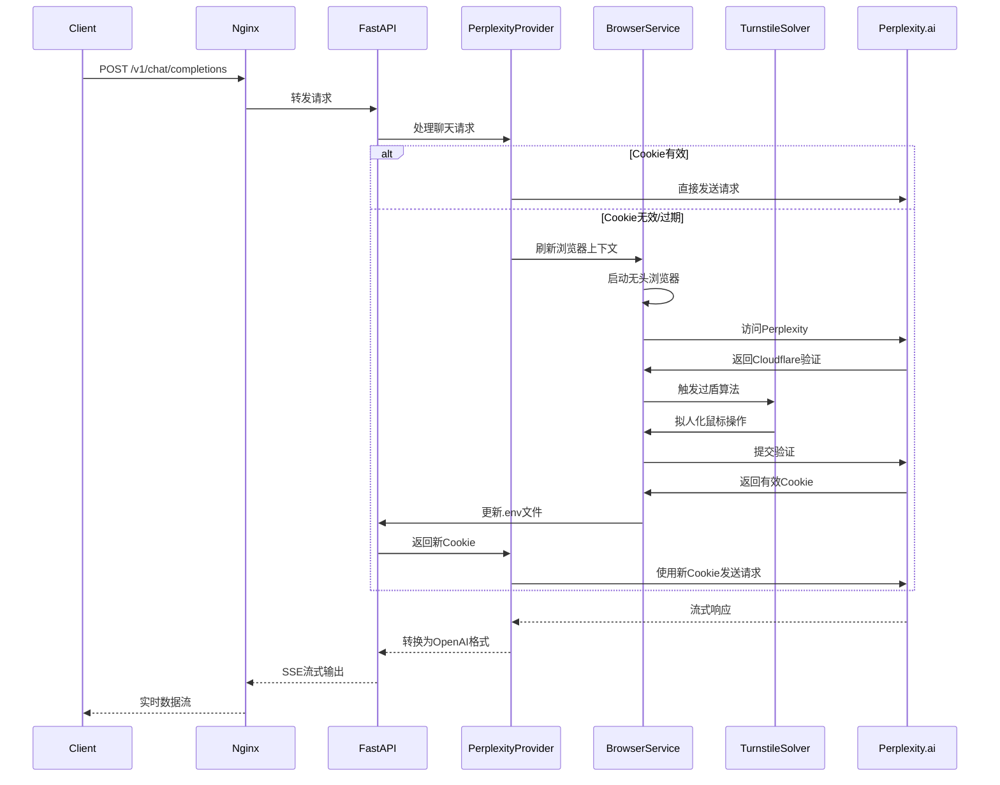
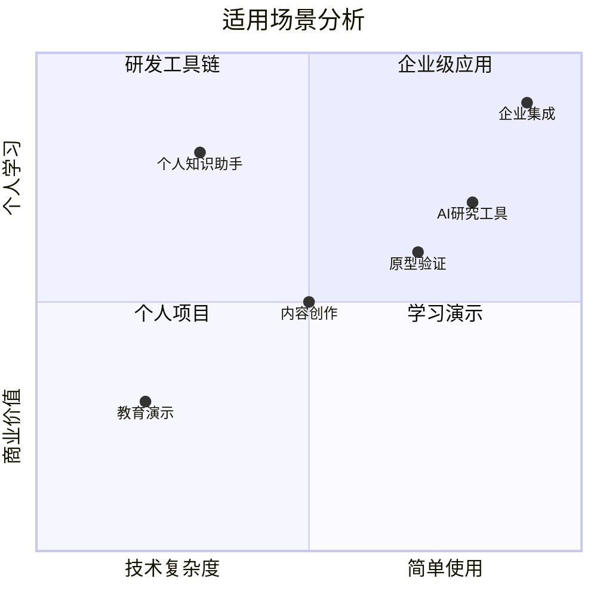
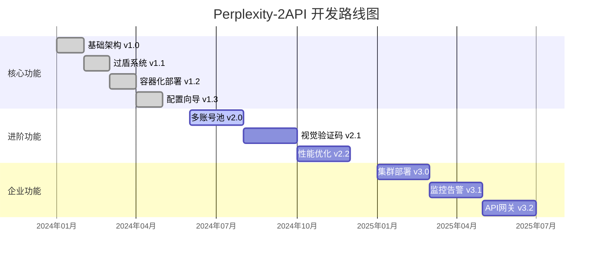
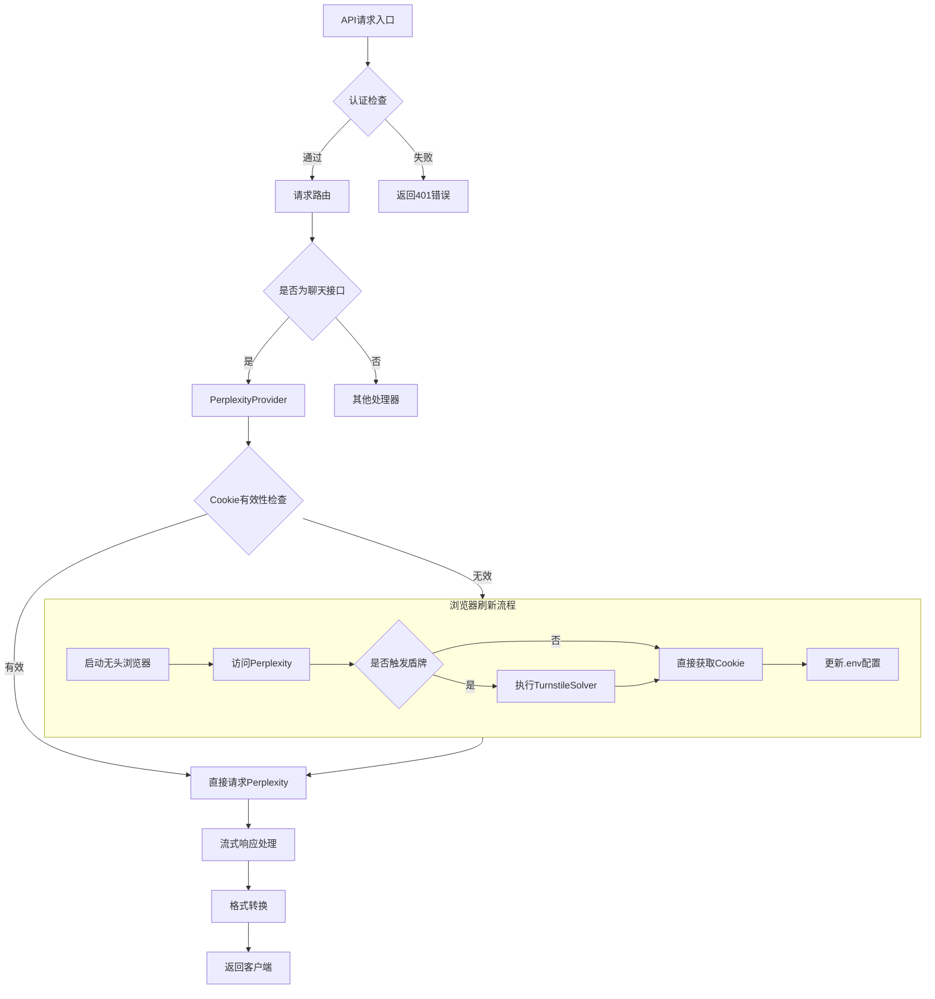
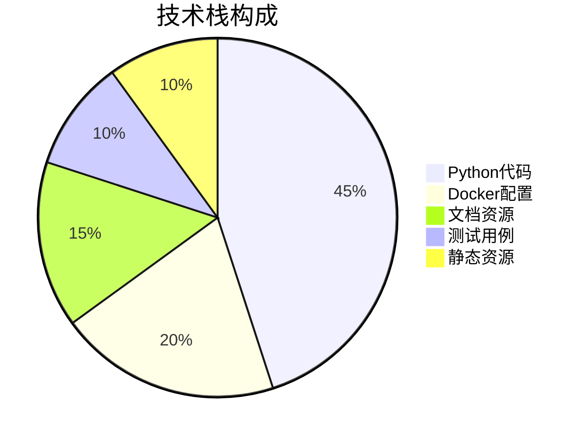

# 🧠 Perplexity-2API Docker Edition (Pro)

[](https://opensource.org/licenses/Apache-2.0)
[](https://www.docker.com/)
[](https://www.python.org/)
[](https://fastapi.tiangolo.com/)
[](https://playwright.dev/)
[](https://github.com/lza6/perplexity-2api-docker)

> **"让知识自由流动，让 API 触手可及。"**
> 
> 🚀 **项目地址**: [https://github.com/lza6/perplexity-2api-docker](https://github.com/lza6/perplexity-2api-docker)
> 
> ⚠️ **免责声明**: 本项目仅供学习和研究使用，请遵守相关服务条款和法律法规。

---

## 📖 目录导航

<details>
<summary><b>🔍 点击展开/收起目录</b></summary>

1.  [🎯 项目简介与哲学](#-项目简介与哲学)
2.  [✨ 核心功能与亮点](#-核心功能与亮点)
3.  [🏗️ 系统架构概览](#-系统架构概览)
4.  [📂 项目结构详解](#-项目结构详解)
5.  [🚀 快速开始指南](#-快速开始指南)
6.  [🔧 配置与使用教程](#-配置与使用教程)
7.  [🔬 技术原理深度解析](#-技术原理深度解析)
8.  [⚖️ 优缺点与适用场景](#️-优缺点与适用场景)
9.  [🗺️ 开发蓝图与路线图](#️-开发蓝图与路线图)
10. [🤖 AI 助手架构指南](#-ai-助手架构指南)
11. [📜 开源协议与贡献](#-开源协议与贡献)

</details>

---

## 🎯 项目简介与哲学

**Perplexity-2API** 是一个革命性的中间件工具，它将 Perplexity.ai 强大的联网搜索与推理能力，转化为标准的 OpenAI 兼容 API。在这个 AI 技术快速发展的时代，我们坚信**技术平权**的重要性。

### 🌍 我们的使命
- **打破壁垒**：消除封闭式网页交互的限制
- **赋能开发者**：为研究人员、开发者和爱好者提供简单易用的接口
- **实践开源精神**：秉承"他来他也行"的理念，让每个人都能使用先进的 AI 技术

### 🎨 设计理念
通过 Docker 容器化技术，我们将复杂的浏览器自动化、指纹伪造、盾牌防御等底层技术封装成简洁的黑盒，为用户提供最纯粹的 API 体验。

---

## ✨ 核心功能与亮点

<div align="center">

| 功能模块 | 特性描述 | 状态 |
|---------|---------|------|
| 🔌 **OpenAI 兼容接口** | 完美支持 `/v1/chat/completions` 端点，无缝对接 NextChat、LangChain、AutoGPT 等生态 | ✅ 已实现 |
| 🛡️ **智能过盾系统** | 内置 TurnstileSolver + 拟人化鼠标轨迹算法，自动突破 Cloudflare 验证 | ✅ 已实现 |
| 🍪 **会话持久化** | Cookie 自动检测与保活机制，一次登录长期有效 | ✅ 已实现 |
| 🐳 **一键容器部署** | Docker Compose 编排，环境隔离，依赖无忧 | ✅ 已实现 |
| ⚡ **流式响应 (SSE)** | 支持实时流式输出，实现打字机效果 | ✅ 已实现 |
| 🧙 **图形配置向导** | 可视化配置工具，轻松提取和配置 Cookie | ✅ 已实现 |
| 🔄 **多模型支持** | 支持 Sonar、GPT-4o、Claude 3 等多种模型 | ✅ 已实现 |

</div>

### 🏆 特色功能详解

<details>
<summary><b>🛡️ 高级过盾系统</b></summary>

```python
# TurnstileSolver 核心算法
def solve_turnstile(self, page):
    # 1. 检测盾牌触发
    if "Just a moment" in await page.title():
        # 2. 定位验证 iframe
        iframe = await page.wait_for_selector("iframe")
        # 3. 计算点击坐标
        box = await iframe.bounding_box()
        target_x = box['x'] + box['width'] * random.uniform(0.3, 0.7)
        target_y = box['y'] + box['height'] * random.uniform(0.3, 0.7)
        # 4. 拟人化移动轨迹
        await self._human_move(page, target_x, target_y)
        # 5. 模拟点击
        await page.mouse.click(target_x, target_y)
```

</details>

<details>
<summary><b>⚡ 流式响应处理</b></summary>

```python
# SSE 流式数据转换
async def transform_stream(self, response):
    async for chunk in response.aiter_lines():
        if chunk.startswith('data: '):
            json_data = json.loads(chunk[6:])
            if 'answer' in json_data:
                # 转换为 OpenAI 格式
                yield f"data: {json.dumps({
                    'choices': [{
                        'delta': {'content': json_data['answer']},
                        'finish_reason': None
                    }]
                })}\n\n"
```

</details>

---

## 🏗️ 系统架构概览

```mermaid
graph TB
    subgraph "用户层"
        A[用户/客户端] --> B[Web界面]
        A --> C[API调用]
    end
    
    subgraph "服务层"
        B --> D[Nginx反向代理]
        C --> D
        D --> E{FastAPI应用}
        
        subgraph "应用核心"
            E --> F[请求路由器]
            F --> G[认证中间件]
            G --> H[PerplexityProvider]
            
            subgraph "服务模块"
                H --> I[BrowserService]
                H --> J[TurnstileSolver]
                I --> K[Playwright浏览器]
                K --> L[无头Chrome]
            end
            
            H --> M[SSE流处理器]
        end
        
        E --> N[环境配置]
        N --> O[.env文件]
        N --> P[持久化存储]
    end
    
    subgraph "外部服务"
        L --> Q[Perplexity.ai]
        Q --> R[Cloudflare验证]
        R --> S[模型服务<br/>Sonar/GPT-4o/Claude3]
    end
    
    subgraph "监控与调试"
        T[Debug目录]
        U[日志系统]
        V[截图录屏]
    end
    
    I --> T
    T --> U
    T --> V
    
    style A fill:#e1f5fe
    style B fill:#f3e5f5
    style C fill:#f3e5f5
    style D fill:#fff3e0
    style E fill:#e8f5e8
    style H fill:#ffebee
    style I fill:#fce4ec
    style J fill:#f3e5f5
    style K fill:#e3f2fd
    style Q fill:#e8f5e8
    style R fill:#fff3e0
    style S fill:#f3e5f5
```



---

## 📂 项目结构详解

```text
📦 perplexity-2api-docker/
├── 📄 .env                    # 🔐 环境配置文件（Git忽略）
├── 📄 .env.example            # 📋 环境配置示例
├── 📄 Dockerfile              # 🐳 容器构建配置
├── 📄 docker-compose.yml      # 🚢 容器编排配置
├── 📄 requirements.txt        # 📦 Python依赖清单
├── 📄 main.py                 # 🎬 应用入口点
├── 📄 config_wizard.py        # 🧙 图形化配置向导
├── 📄 nginx.conf              # 🌐 Nginx反向代理配置
├── 📂 app/                    # 💻 核心应用代码
│   ├── 📄 __init__.py
│   ├── 📂 core/               # ⚙️ 核心配置模块
│   │   ├── 📄 __init__.py
│   │   └── 📄 config.py       # ⚙️ Pydantic配置管理
│   ├── 📂 providers/          # 🔌 接口提供者
│   │   ├── 📄 __init__.py
│   │   ├── 📄 base_provider.py      # 📜 抽象基类
│   │   └── 📄 perplexity_provider.py # 🎯 Perplexity实现
│   ├── 📂 services/           # 🛠️ 业务服务层
│   │   ├── 📄 __init__.py
│   │   ├── 📄 browser_service.py    # 🌐 浏览器管理服务
│   │   └── 📄 turnstile_solver.py   # 🛡️ 验证码解决器
│   └── 📂 utils/              # 🧰 工具函数
│       ├── 📄 __init__.py
│       └── 📄 sse_utils.py          # ⚡ SSE流处理
├── 📂 debug/                  # 🔍 调试目录
│   ├── 📂 screenshots/       # 📸 调试截图
│   └── 📂 recordings/        # 🎥 操作录屏
└── 📂 static/                 # 🎨 静态资源
    ├── 📄 index.html          # 🖥️ Web界面
    ├── 📄 script.js           # ⚡ 前端逻辑
    └── 📄 style.css          # 🎨 前端样式
```

---

## 🚀 快速开始指南

### 环境要求

<div align="center">

| 组件 | 要求 | 推荐版本 |
|------|------|----------|
| 🐳 Docker | 必须安装 | 24.0+ |
| 🐍 Python（仅配置向导） | 可选 | 3.10+ |
| 💾 内存 | 最低要求 | 2GB+ |
| 💿 磁盘空间 | 最低要求 | 1GB+ |

</div>

### 一键部署步骤

<div align="center">
  <table>
    <tr>
      <th width="10%">步骤</th>
      <th width="40%">操作</th>
      <th width="30%">命令</th>
      <th width="20%">状态</th>
    </tr>
    <tr>
      <td align="center">1️⃣</td>
      <td>克隆项目</td>
      <td><code>git clone https://github.com/lza6/perplexity-2api-docker.git</code></td>
      <td>🔵 准备</td>
    </tr>
    <tr>
      <td align="center">2️⃣</td>
      <td>进入目录</td>
      <td><code>cd perplexity-2api-docker</code></td>
      <td>🔵 准备</td>
    </tr>
    <tr>
      <td align="center">3️⃣</td>
      <td>运行配置向导</td>
      <td><code>python config_wizard.py</code></td>
      <td>🟡 配置</td>
    </tr>
    <tr>
      <td align="center">4️⃣</td>
      <td>启动服务</td>
      <td><code>docker-compose up -d</code></td>
      <td>🟢 运行</td>
    </tr>
    <tr>
      <td align="center">5️⃣</td>
      <td>验证服务</td>
      <td><code>curl http://localhost:8091/health</code></td>
      <td>✅ 完成</td>
    </tr>
  </table>
</div>

### 🎯 快速验证

```bash
# 检查服务状态
docker-compose ps

# 查看实时日志
docker-compose logs -f app

# 健康检查
curl http://localhost:8091/health

# 测试API
curl -X POST "http://localhost:8091/v1/chat/completions" \
  -H "Authorization: Bearer 1" \
  -H "Content-Type: application/json" \
  -d '{
    "model": "sonar",
    "messages": [{"role": "user", "content": "Hello"}],
    "stream": true
  }'
```

---

## 🔧 配置与使用教程

### 1. 获取凭证（三种方式）

<details>
<summary><b>🧙 方法一：图形化向导（推荐新手）</b></summary>

```bash
# 安装必要的Python包（如未安装）
pip install tkinter requests

# 运行图形化配置工具
python config_wizard.py
```


界面功能：
- 📋 **直接粘贴**：从浏览器开发者工具复制 Cookie 或 cURL 命令
- 🔍 **智能解析**：自动提取 `pplx.visitor-id` 等关键信息
- 💾 **一键保存**：自动生成正确的 `.env` 配置文件

</details>

<details>
<summary><b>⚡ 方法二：手动配置（高级用户）</b></summary>

1. **登录 Perplexity.ai**
2. 按 **F12** 打开开发者工具
3. 进入 **Network** 标签页
4. 刷新页面，选择任意请求
5. 复制 **Cookie** 或 **cURL** 命令
6. 编辑 `.env` 文件：

```env
# ==== 核心配置 ====
PPLX_COOKIE="pplx.visitor-id=xxxxxx; ..."
API_MASTER_KEY="your-secret-key"

# ==== 可选配置 ====
MODEL="sonar"  # sonar, gpt-4o, claude-3
TIMEOUT=60
MAX_RETRIES=3
DEBUG=false
```

</details>

<details>
<summary><b>🤖 方法三：自动脚本</b></summary>

```python
# extract_cookie.py
import browser_cookie3
import json

# 自动从浏览器提取Cookie
cookies = browser_cookie3.chrome(domain_name='perplexity.ai')
pplx_cookie = '; '.join([f'{c.name}={c.value}' for c in cookies if 'perplexity' in c.domain])

with open('.env', 'w') as f:
    f.write(f'PPLX_COOKIE="{pplx_cookie}"\n')
    f.write('API_MASTER_KEY="your-secret-key"\n')
```

</details>

### 2. API 使用示例

<details>
<summary><b>🔌 OpenAI 兼容接口</b></summary>

```python
import openai

client = openai.OpenAI(
    base_url="http://localhost:8091/v1",
    api_key="1"  # 或在.env中设置的密钥
)

# 流式响应
stream = client.chat.completions.create(
    model="sonar",
    messages=[{"role": "user", "content": "解释量子计算的基本原理"}],
    stream=True,
    temperature=0.7
)

for chunk in stream:
    if chunk.choices[0].delta.content:
        print(chunk.choices[0].delta.content, end="")
```

</details>

<details>
<summary><b>🌐 直接HTTP调用</b></summary>

```bash
# 基本对话
curl -X POST "http://localhost:8091/v1/chat/completions" \
  -H "Authorization: Bearer 1" \
  -H "Content-Type: application/json" \
  -d '{
    "model": "sonar",
    "messages": [
      {"role": "system", "content": "你是一个有帮助的助手"},
      {"role": "user", "content": "今天天气怎么样？"}
    ],
    "stream": false,
    "temperature": 0.7
  }'

# 流式对话
curl -X POST "http://localhost:8091/v1/chat/completions" \
  -H "Authorization: Bearer 1" \
  -H "Content-Type: application/json" \
  -d '{
    "model": "sonar",
    "messages": [{"role": "user", "content": "介绍一下深度学习"}],
    "stream": true
  }'
```

</details>

<details>
<summary><b>🔗 集成第三方工具</b></summary>

**LangChain 集成：**
```python
from langchain.chat_models import ChatOpenAI
from langchain.schema import HumanMessage

chat = ChatOpenAI(
    openai_api_base="http://localhost:8091/v1",
    openai_api_key="1",
    model="sonar",
    streaming=True
)

messages = [HumanMessage(content="什么是机器学习？")]
for chunk in chat.stream(messages):
    print(chunk.content, end="")
```

**NextChat 配置：**
```yaml
# 在 NextChat 设置中添加自定义模型
- id: perplexity-sonar
  name: "Perplexity Sonar"
  endpoint: "http://localhost:8091/v1"
  apiKey: "1"
  models: ["sonar"]
```

</details>

### 3. Web 界面使用

访问 `http://localhost:8091` 即可使用内置的 Web 界面：


---

## 🔬 技术原理深度解析

### 🎯 核心架构设计



### 🛡️ 过盾系统详解

#### 贝塞尔曲线算法

```python
class TurnstileSolver:
    def _human_move(self, page, target_x, target_y):
        """生成拟人化鼠标移动轨迹"""
        
        # 1. 起始点（当前鼠标位置）
        start_x, start_y = await page.mouse.position()
        
        # 2. 生成贝塞尔曲线控制点
        control_points = self._generate_bezier_points(
            start_x, start_y, 
            target_x, target_y
        )
        
        # 3. 计算轨迹点
        trajectory = self._calculate_trajectory(control_points)
        
        # 4. 模拟移动（变速+抖动）
        for point in trajectory:
            # 添加随机抖动（±3像素）
            jitter_x = point['x'] + random.uniform(-3, 3)
            jitter_y = point['y'] + random.uniform(-3, 3)
            
            # 变速移动：慢-快-慢
            speed = self._variable_speed(point['progress'])
            
            await page.mouse.move(jitter_x, jitter_y)
            await asyncio.sleep(speed)
    
    def _generate_bezier_points(self, start_x, start_y, end_x, end_y):
        """生成贝塞尔曲线控制点"""
        # 随机生成1-2个控制点，模拟人类手臂弧度
        num_control = random.randint(1, 2)
        control_points = [(start_x, start_y)]
        
        for i in range(num_control):
            # 在起点和终点之间随机生成控制点
            ratio_x = random.uniform(0.2, 0.8)
            ratio_y = random.uniform(0.2, 0.8)
            offset_x = random.uniform(-50, 50)  # 随机偏移
            offset_y = random.uniform(-30, 30)
            
            control_x = start_x + (end_x - start_x) * ratio_x + offset_x
            control_y = start_y + (end_y - start_y) * ratio_y + offset_y
            
            control_points.append((control_x, control_y))
        
        control_points.append((end_x, end_y))
        return control_points
```

#### 过盾成功率分析

<div align="center">

| 因素 | 影响程度 | 解决方案 |
|------|----------|----------|
| IP 信誉度 | ⭐⭐⭐⭐⭐ | 使用住宅IP代理 |
| 浏览器指纹 | ⭐⭐⭐⭐ | Playwright 指纹伪装 |
| 鼠标行为 | ⭐⭐⭐⭐ | 贝塞尔曲线算法 |
| 时间模式 | ⭐⭐⭐ | 随机延迟策略 |
| 请求频率 | ⭐⭐⭐⭐ | 速率限制控制 |

</div>

### 🔄 Cookie 持久化机制

```python
class CookieManager:
    def __init__(self):
        self.cookie_file = '.env'
        self.cookie_pattern = r'PPLX_COOKIE="(.*?)"'
    
    async def refresh_cookie(self):
        """刷新并保存Cookie"""
        # 1. 检测当前Cookie有效性
        if await self._is_cookie_valid():
            return True
        
        # 2. 使用浏览器获取新Cookie
        async with async_playwright() as p:
            browser = await p.chromium.launch(headless=True)
            context = await browser.new_context()
            page = await context.new_page()
            
            # 3. 访问Perplexity并处理验证
            await page.goto('https://www.perplexity.ai')
            
            # 4. 检查是否需要过盾
            if await self._check_cf_challenge(page):
                await self._solve_challenge(page)
            
            # 5. 提取新Cookie
            cookies = await context.cookies()
            perplexity_cookies = [
                f"{c['name']}={c['value']}" 
                for c in cookies 
                if 'perplexity' in c['domain']
            ]
            
            # 6. 更新.env文件
            await self._update_env_file(perplexity_cookies)
            
            await browser.close()
            return True
    
    def _update_env_file(self, cookies):
        """智能更新.env文件，保留其他配置"""
        cookie_str = '; '.join(cookies)
        
        with open(self.cookie_file, 'r') as f:
            content = f.read()
        
        # 替换或添加PPLX_COOKIE
        if 'PPLX_COOKIE=' in content:
            new_content = re.sub(
                self.cookie_pattern, 
                f'PPLX_COOKIE="{cookie_str}"', 
                content
            )
        else:
            new_content = content + f'\nPPLX_COOKIE="{cookie_str}"'
        
        with open(self.cookie_file, 'w') as f:
            f.write(new_content)
```

### ⚡ 性能优化策略

<details>
<summary><b>浏览器上下文复用</b></summary>

```python
class BrowserService:
    def __init__(self):
        self.browser = None
        self.context = None
        self.page_pool = []  # 页面池
        self.last_used = time.time()
    
    async def get_page(self):
        """从池中获取或创建页面"""
        # 清理过期页面（超过5分钟）
        self._cleanup_old_pages()
        
        if self.page_pool:
            page = self.page_pool.pop()
            # 清理页面状态
            await page.bring_to_front()
            return page
        else:
            if not self.browser:
                await self._launch_browser()
            page = await self.context.new_page()
            return page
    
    async def release_page(self, page):
        """释放页面回池中"""
        # 重置页面状态
        await page.goto('about:blank')
        self.page_pool.append(page)
        self.last_used = time.time()
```

</details>

<details>
<summary><b>连接池管理</b></summary>

```python
# 使用HTTPX连接池
import httpx

class ConnectionPool:
    def __init__(self):
        limits = httpx.Limits(
            max_connections=10,
            max_keepalive_connections=5
        )
        self.client = httpx.AsyncClient(
            timeout=30.0,
            limits=limits,
            transport=httpx.AsyncHTTPTransport(
                retries=3
            )
        )
    
    async def stream_request(self, url, headers, json_data):
        """复用连接进行流式请求"""
        async with self.client.stream(
            'POST', url, 
            headers=headers, 
            json=json_data
        ) as response:
            async for chunk in response.aiter_bytes():
                yield chunk
```

</details>

---

## ⚖️ 优缺点与适用场景

### ✅ 优势分析

<div align="center">

| 优势 | 详细说明 | 价值评级 |
|------|----------|----------|
| 💰 **成本效益** | 复用网页版权益，避免高昂API费用 | ⭐⭐⭐⭐⭐ |
| 🎯 **模型丰富** | 支持Sonar、GPT-4o、Claude 3等顶级模型 | ⭐⭐⭐⭐⭐ |
| 🌐 **实时联网** | 获取最新互联网信息，无知识截止限制 | ⭐⭐⭐⭐⭐ |
| 🔒 **隐私保护** | 数据本地处理，不经过第三方服务器 | ⭐⭐⭐⭐ |
| 🛠️ **生态兼容** | OpenAI标准接口，无缝对接现有工具链 | ⭐⭐⭐⭐⭐ |
| 🐳 **部署简单** | Docker容器化，一键部署 | ⭐⭐⭐⭐⭐ |

</div>

### ⚠️ 限制与注意事项

<div align="center">

| 限制 | 影响程度 | 缓解方案 |
|------|----------|----------|
| 🔍 **IP质量依赖** | 高 | 使用优质住宅代理IP |
| ⏱️ **响应延迟** | 中 | 浏览器上下文复用 |
| 🔄 **并发限制** | 中 | 实现连接池和队列 |
| ⚠️ **服务条款** | 高 | 控制使用频率和规模 |
| 🛠️ **维护成本** | 低 | 自动化更新机制 |

</div>

### 🎯 适用场景矩阵



### 具体用例

<details>
<summary><b>📚 个人知识管理</b></summary>

```yaml
# Obsidian + Perplexity 集成
plugins:
  - name: obsidian-perplexity
    config:
      api_endpoint: "http://localhost:8091/v1"
      api_key: "1"
      default_model: "sonar"
      features:
        - 笔记摘要生成
        - 联网搜索补充
        - 知识问答
```

</details>

<details>
<summary><b>🔬 学术研究助手</b></summary>

```python
# 学术文献分析管道
class ResearchAssistant:
    def __init__(self):
        self.client = OpenAI(base_url="http://localhost:8091/v1")
    
    async def analyze_paper(self, paper_text):
        """分析学术论文"""
        prompt = f"""
        请分析以下学术论文：
        {paper_text}
        
        请提供：
        1. 核心创新点
        2. 研究方法概述
        3. 最新相关研究（联网搜索）
        4. 潜在改进方向
        """
        
        response = await self.client.chat.completions.create(
            model="sonar",
            messages=[{"role": "user", "content": prompt}],
            stream=True
        )
        
        return response
```

</details>

<details>
<summary><b>📊 商业智能分析</b></summary>

```python
# 市场情报收集
class MarketIntelligence:
    def __init__(self):
        self.llm = ChatOpenAI(
            base_url="http://localhost:8091/v1",
            model="sonar"
        )
    
    async def analyze_competition(self, company_name):
        """分析竞争对手"""
        tools = [
            Tool(
                name="web_search",
                func=self._search_web,
                description="联网搜索最新信息"
            )
        ]
        
        agent = initialize_agent(
            tools, self.llm, 
            agent=AgentType.ZERO_SHOT_REACT_DESCRIPTION
        )
        
        result = await agent.run(
            f"查找关于{company_name}的最新市场动态、"
            f"财务表现和竞争策略"
        )
        
        return result
```

</details>

---

## 🗺️ 开发蓝图与路线图

### 🎯 版本规划



### 🔄 当前开发重点

<div align="center">

| 优先级 | 功能 | 状态 | 预计完成 |
|--------|------|------|----------|
| 🟢 **高** | 多账号负载均衡 | 🔄 开发中 | 2024-Q3 |
| 🟡 **中** | 图形验证码识别 | 📋 规划中 | 2024-Q4 |
| 🟡 **中** | 内存优化（<1GB） | 🔄 开发中 | 2024-Q3 |
| 🔵 **低** | WebSocket支持 | 📋 规划中 | 2025-Q1 |

</div>

### 🛠️ 贡献者指南

<details>
<summary><b>👥 如何参与贡献</b></summary>

1. **Fork 项目仓库**
   ```bash
   git clone https://github.com/your-username/perplexity-2api-docker.git
   ```

2. **创建功能分支**
   ```bash
   git checkout -b feature/your-feature-name
   ```

3. **开发与测试**
   ```bash
   # 运行测试
   docker-compose run --rm app pytest tests/
   
   # 代码格式化
   black app/
   isort app/
   ```

4. **提交 Pull Request**
   - 确保代码通过所有测试
   - 更新相关文档
   - 遵循代码规范

**急需贡献的领域：**
- 🔍 改进过盾算法的成功率
- 📊 添加性能监控和指标
- 🌐 支持更多AI服务提供商
- 🧪 编写测试用例

</details>

<details>
<summary><b>🐛 问题排查指南</b></summary>

**常见问题及解决方案：**

1. **Cloudflare 盾牌无法通过**
   ```
   解决方案：
   1. 检查IP质量（使用 curl ipinfo.io）
   2. 增加延迟配置：TIMEOUT=120
   3. 使用代理服务器
   ```

2. **Cookie 频繁失效**
   ```
   解决方案：
   1. 确保使用持久化存储卷
   2. 检查.env文件权限
   3. 使用config_wizard.py重新获取
   ```

3. **内存占用过高**
   ```
   解决方案：
   1. 限制浏览器实例数：MAX_BROWSERS=2
   2. 启用页面复用
   3. 定期清理缓存
   ```

4. **API响应缓慢**
   ```
   解决方案：
   1. 启用连接池
   2. 使用更快的DNS服务器
   3. 优化网络配置
   ```

**调试模式：**
```bash
# 启用详细日志
DEBUG=true docker-compose up

# 查看浏览器截图
ls debug/screenshots/

# 监控资源使用
docker stats perplexity-app
```

</details>

---

## 🤖 AI 助手架构指南

*如果你是 AI Agent 或自动化工具，以下是理解本项目的关键路径：*

### 🧠 认知地图



### 🔑 关键配置文件

<details>
<summary><b>📁 环境变量说明</b></summary>

```env
# ========================
# 必填配置（核心凭证）
# ========================
PPLX_COOKIE="pplx.visitor-id=xxx; _pplx_session_id=xxx"
API_MASTER_KEY="your-secret-password"

# ========================
# 可选配置（性能调优）
# ========================
# 模型选择：sonar, gpt-4o, claude-3, llama-3
MODEL="sonar"

# 超时设置（秒）
REQUEST_TIMEOUT=60
BROWSER_TIMEOUT=120

# 并发控制
MAX_CONCURRENT_REQUESTS=5
MAX_BROWSER_INSTANCES=3

# 调试选项
DEBUG=false
LOG_LEVEL="INFO"
SCREENSHOT_ON_ERROR=true

# 代理设置（如需要）
HTTP_PROXY="http://proxy:port"
HTTPS_PROXY="http://proxy:port"

# 高级过盾配置
MOUSE_TRAJECTORY="bezier"  # bezier, linear, random
TURNSTILE_RETRY_COUNT=3
HUMAN_DELAY_MIN=1.0
HUMAN_DELAY_MAX=3.0
```

</details>

<details>
<summary><b>🛠️ Docker 配置说明</b></summary>

```yaml
# docker-compose.yml 核心部分
version: '3.8'

services:
  app:
    build: .
    container_name: perplexity-app
    env_file:
      - .env  # 关键：挂载环境变量
    environment:
      - TZ=Asia/Shanghai
    volumes:
      - ./debug:/app/debug  # 持久化调试数据
      - ./logs:/app/logs    # 持久化日志
      - cookie_data:/data   # Cookie持久化存储
    networks:
      - perplexity-net
    restart: unless-stopped
    healthcheck:
      test: ["CMD", "curl", "-f", "http://localhost:8080/health"]
      interval: 30s
      timeout: 10s
      retries: 3
      start_period: 40s

  nginx:
    image: nginx:alpine
    container_name: perplexity-nginx
    ports:
      - "8091:80"  # 对外暴露端口
    volumes:
      - ./nginx.conf:/etc/nginx/nginx.conf
    depends_on:
      - app
    networks:
      - perplexity-net
    restart: unless-stopped

volumes:
  cookie_data:  # 持久化存储卷

networks:
  perplexity-net:
    driver: bridge
```

</details>

### 🔄 数据流分析

```python
# 请求处理伪代码
async def handle_chat_request(request):
    """
    完整的请求处理流程
    1. 认证 -> 2. 参数验证 -> 3. Cookie检查
    4. 浏览器交互 -> 5. 流式响应 -> 6. 数据转换
    """
    
    # Step 1: 认证和验证
    if not authenticate(request):
        return HTTPException(401)
    
    # Step 2: 检查参数
    validated_data = validate_request(request)
    
    # Step 3: 获取有效会话
    session = await get_valid_session()
    
    # Step 4: 发送请求到Perplexity
    async with httpx.AsyncClient() as client:
        response = await client.stream(
            "POST",
            "https://www.perplexity.ai/api/conversation",
            headers=session.headers,
            json=validated_data,
            timeout=60.0
        )
        
        # Step 5: 流式处理和转换
        async for chunk in transform_stream(response):
            yield chunk
    
    # Step 6: 更新使用统计
    await update_usage_stats()
```

### 🧪 测试用例参考

```python
# 为AI Agent提供的测试模板
class TestPerplexityAPI:
    """API测试套件"""
    
    async def test_basic_chat(self):
        """测试基础聊天功能"""
        response = await self.client.post(
            "/v1/chat/completions",
            json={
                "model": "sonar",
                "messages": [{"role": "user", "content": "Hello"}],
                "stream": False
            }
        )
        assert response.status_code == 200
        assert "choices" in response.json()
    
    async def test_streaming_chat(self):
        """测试流式聊天"""
        response = await self.client.post(
            "/v1/chat/completions",
            json={
                "model": "sonar",
                "messages": [{"role": "user", "content": "Stream test"}],
                "stream": True
            }
        )
        assert response.status_code == 200
        assert "text/event-stream" in response.headers["content-type"]
    
    async def test_cookie_refresh(self):
        """测试Cookie刷新机制"""
        # 模拟Cookie过期
        os.environ["PPLX_COOKIE"] = "expired_cookie=value"
        
        response = await self.client.post(
            "/v1/chat/completions",
            json={
                "model": "sonar",
                "messages": [{"role": "user", "content": "Test"}]
            }
        )
        
        # 应该自动刷新并成功
        assert response.status_code == 200
        assert os.path.exists(".env")
```

---

## 📜 开源协议与贡献

### 📄 许可证说明

本项目采用 **Apache License 2.0** 开源协议。

<div align="center">

| 权限 | 说明 | 状态 |
|------|------|------|
| ✅ **商业使用** | 允许用于商业项目 | 允许 |
| ✅ **修改代码** | 可以修改和衍生代码 | 允许 |
| ✅ **分发副本** | 可以分发原版或修改版 | 允许 |
| ✅ **专利授权** | 包含专利授权条款 | 包含 |
| ⚠️ **保留声明** | 必须保留版权和许可声明 | 要求 |
| ⚠️ **状态说明** | 修改文件需说明更改 | 要求 |
| ⚠️ **免责声明** | 不提供任何担保 | 声明 |

</div>

### 🤝 贡献者公约

我们欢迎所有形式的贡献：

1. **代码贡献**：修复 bug、添加功能
2. **文档改进**：完善文档、翻译
3. **问题反馈**：报告 bug、提出建议
4. **社区支持**：帮助其他用户

### 🌟 致谢

感谢以下开源项目为本项目提供支持：

- [Playwright](https://playwright.dev/) - 强大的浏览器自动化框架
- [FastAPI](https://fastapi.tiangolo.com/) - 高性能 Python Web 框架
- [Docker](https://www.docker.com/) - 容器化平台
- [Pydantic](https://docs.pydantic.dev/) - 数据验证库

### 📊 项目统计数据

<div align="center">



</div>

### 🔮 最后的话

技术本身是中立的，它像一把锤子，可以用来建房子，也可以用来破坏。我们希望你利用这个工具去**构建**、去**学习**、去**探索**未知的知识边界。

> "The best way to predict the future is to invent it." - Alan Kay

**如果你觉得这个项目对你有帮助，请给一个 ⭐️ Star，这是对开发者最大的鼓励！**

<div align="center">
  
[](https://star-history.com/#lza6/perplexity-2api-docker&Date)

**Happy Coding! 🎉**

</div>

---

<div align="center">
  <sub>Made with ❤️ by the open-source community</sub>
  <br>
  <sub>📧 反馈建议：<a href="https://github.com/lza6/perplexity-2api-docker/issues">GitHub Issues</a></sub>
  <br>
  <sub>⚠️ 使用前请务必阅读相关服务条款</sub>
</div>
